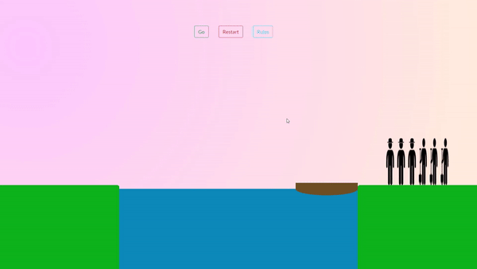

# 𝕄𝕚𝕤𝕤𝕚𝕠𝕟𝕒𝕣𝕚𝕖𝕤 𝕒𝕟𝕕 ℂ𝕒𝕟𝕟𝕚𝕓𝕒𝕝𝕤

It is a simple game made with javascript. In this game three missionaries and three cannibals need to be crossed a river using a boat which can carry at most two people, under the constraint that, for both banks, if there are missionaries present on the bank, they cannot be outnumbered by cannibals (if they were, the cannibals would eat the missionaries). The boat cannot cross the river by itself with no people on board.

### Checkout my other repository

+ [ToDo](https://github.com/amankumar6/ToDo)
+ [Top10List](https://github.com/amankumar6/Top10List-React)
+ [Epic Player](https://github.com/amankumar6/Epic-Player)
+ [Covid-19 Status](https://github.com/amankumar6/COVID_19)
+ [Basic Calculator](https://github.com/amankumar6/Basic-Calculator)
+ [WordCountingApp](https://github.com/amankumar6/WordCountingApp)
+ [Hexagon](https://github.com/amankumar6/Hexagon)
